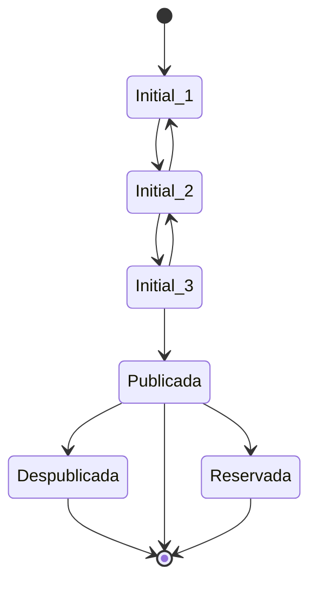
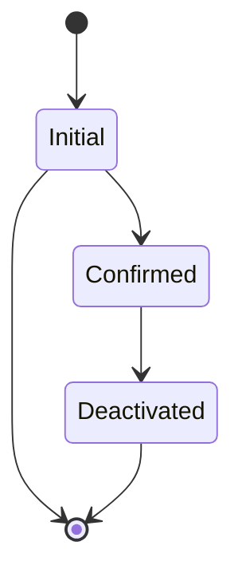
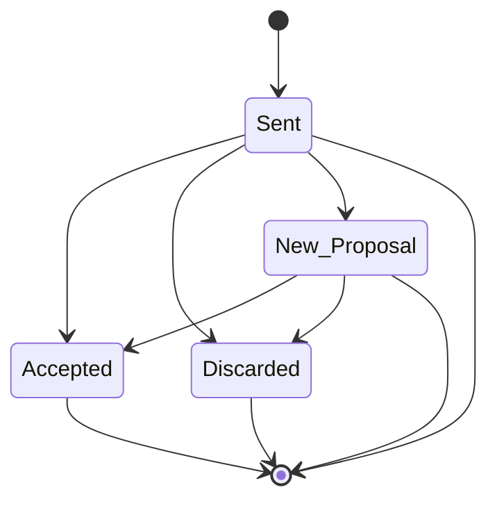

# Endpoints
/auths \
/users \
/users/favs \
/properties \
/contacts \
/contracts \
/healtcheck \
/authGoogle >> Log-In de usuario con Google. \

# Commands

Requerimientos:
- Node y NPM
- Docker, docker compose (Opcional)
- Makefile (opcional)

## Iniciar app
Nota: Se debe tener un .env en el root con las variables de entornos y secretos necesarios par acorrer la aplicacion: GMAIL, GOOGLE MAPS, CLOUDINARY, etc.

Con Node & NPM instalados: 

    npm install && npm run dev

Nota: se debe usar una base de datos de POSTGRES remota; utilizar el .env que esta en la carpeta /.envs/remoto/.env 

Con docker compose:

    docker compose up -d --build --force-recreate backend-myhome.app

Nota: levantara la app y postgres localmente, por lo tanto el .env debe ser el local, utilizar el de la carpeta /.envs/local/.env

Con Makefile:

    make up

Nota: ejecuta comandos de docker compose, por lo tanto aplica lo mismo que docker-compose.

# Eliminar contenedores y db (local)

    docker rm -f $(docker ps -a -q) --volumes

ó 

    docker compose -f ./docker-compose.yaml down --volumes

Option 2 con Makefile: 

    make down

# postgres

Para acceder a postgres:

Option 1: 
1. > docker exec -it backend-myhome.pg /bin/bash
2. > psql -U root -d myhome

Option 2 (con Makefile):

    make pgconsole
  
Comandos útiles postgres:
> \du+
list all users 

> \l
list all databases

> \c myhome
switch to myhome database

> \dt
list all tables

# Estado de Propiedad

# Estado de Usuario

# Estado de Contacto
