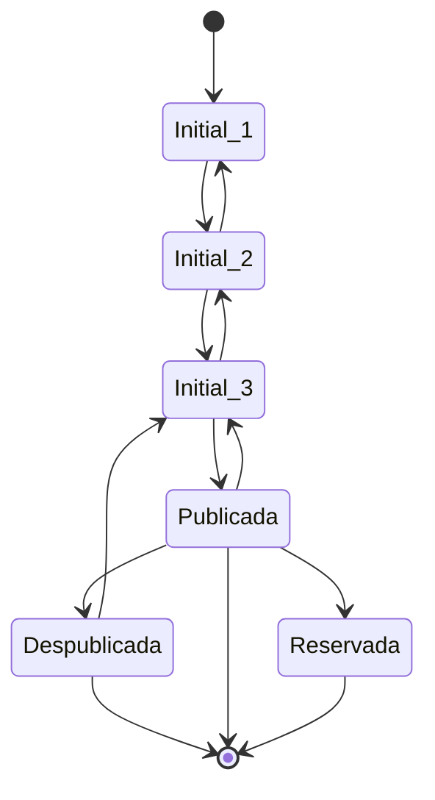
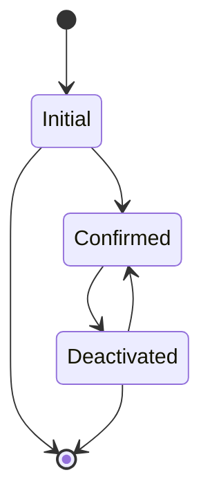
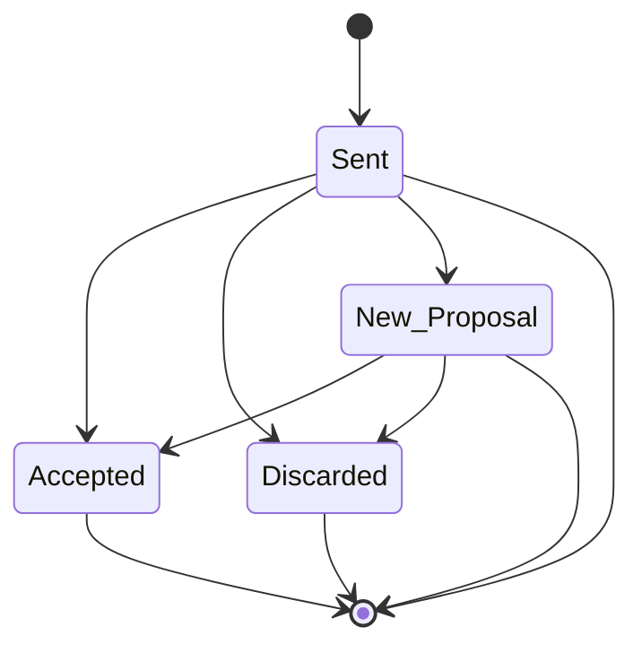

# Tabla de Contenidos
1. [Introducción](#Introduccion)
2. [Instalación](#Instalacion)
3. [Documentación](#Documentacion)
4. [Equipo de Trabajo](#Team)
5. [Conclusión](#End)

# Introduccion
Este trabajo se realizo para la materia "Aplicaciones Distribuidas" ciclo 2023.
Proyecto que conecta inmobiliarias con personas que necesitan alquilar o comprar propiedades así como la gestión del contacto y contrato de dichas transacciones a través de una aplicación movil.

## Stack \
*Front End*: React Native \
*Back End*: Node JS + Express + PostgreSQL. \
*APIs y dependencias*: Estandar JWT para autenticacion y autorizacion; postgis para la geolocalización de propiedades, Google Maps API para la geocodificación de direcciones de las propiedades, Cloudinary para el almacenamiento de imagenes de propiedades y perfiles, Google Gmail API para el envío de mails de confirmación de cuenta y notificaciones de transacciones recibidas. \

# Instalacion

Requerimientos:
- Node y NPM
- Docker, docker compose (Opcional)
- Makefile (opcional)

## Iniciar app
Nota: Se debe tener un .env en el root con las variables de entornos y secretos necesarios par acorrer la aplicacion: GMAIL, GOOGLE MAPS, CLOUDINARY, etc.

Con Node & NPM instalados: 

    npm install && npm run dev

Nota: se debe usar una base de datos de POSTGRES remota; utilizar el .env que esta en la carpeta /.envs/remoto/.env 

Con docker compose:

    docker compose up -d --build --force-recreate backend-myhome.app

Nota: levantara la app y postgres localmente, por lo tanto el .env debe ser el local, utilizar el de la carpeta /.envs/local/.env

Con Makefile:

    make up

Nota: ejecuta comandos de docker compose, por lo tanto aplica lo mismo que docker-compose.

## Eliminar contenedores y db (local)

    docker rm -f $(docker ps -a -q) --volumes

ó 

    docker compose -f ./docker-compose.yaml down --volumes

Option 2 con Makefile: 

    make down

## postgres

Para acceder a postgres:

Option 1: 
1. > docker exec -it backend-myhome.pg /bin/bash
2. > psql -U root -d myhome

Option 2 (con Makefile):

    make pgconsole
  
Comandos útiles postgres:
> \du+
list all users 

> \l
list all databases

> \c myhome
switch to myhome database

> \dt
list all tables

# Documentacion

## Endpoints
/auths \
/users \
/users/favs \
/properties \
/contacts \
/contracts \
/healtcheck \
/authGoogle >> Log-In de usuario con Google. \

## Estado de Propiedad

## Estado de Usuario

## Estado de Contacto

# Team
| Nombre                    | Legajo    | Tareas                               |
| ------------------------- | --------- | ------------------------------------ |
| Angelino, Lucas           | 1083708   | Frontend, Documentacion, QA          |
| Lacuesta, Gaston Axel     | 1117695   | Backend, Frontend, Documentacion, QA |
| Rojas, Gabriel            | 1099809   | Frontend, Documentacion, QA          |
| Streule, Agustina         | 1110159   | Backend, Frontend, Documentacion, QA |

# Conclusión
Al comienzo de este proyecto ninguno de los integrantes del equipo sabíamos de React Native y sólo dos integrantes sabían de Front End. \
En este proyecto aprendimos a diseñar, implementar e integrar el backend con una aplicación móvil desde cero, lo cual es de gran valor para nuestra carrera. \
Del lado del backend es la tercera vez que implementamos un proyecto en Node JS, así que esto ayudo a fijar los conocimientos respecto a este lenguaje, al igual que con la base de datos. \
Se absorbieron conocimientos sobre la integración con APIs de información geográfica como lo es la API de Google Maps y la extensión POSTGIS para postgresql. \
Por otro lado se incorporaron nuevos conocimientos sobre deployment de backend en la nube con contenedores (docker-compose).